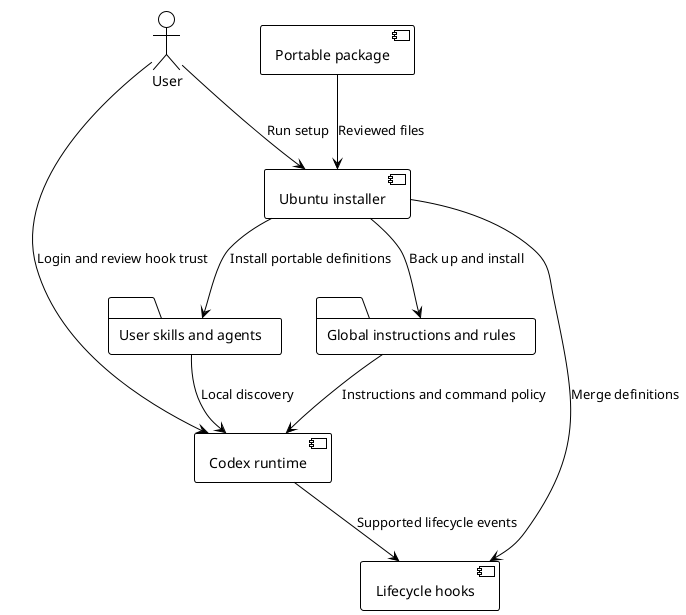

# Portable Codex environment on Ubuntu

## Install

Use the temporary branch `transfer/company-config-20261005`. From the repository root:

```bash
bash scripts/setup-ubuntu.sh
codex login
codex --profile company
```

The setup installs the Ubuntu shell configuration, terminal dependencies and portable
Claude/Codex instructions. If Codex is absent, it installs `@openai/codex@0.159.3` under
`~/.local` without changing a system Node installation. If Node/npm are absent, it
installs the Ubuntu packages. Existing Codex installations are preserved; check their
version and update separately if their configuration schema differs.

For configuration only, without dependencies or CLI installation:

```bash
bash scripts/setup-ubuntu.sh --config-only
```

For Codex only:

```bash
python3 scripts/install-codex.py
python3 scripts/install-codex.py --verify
```

Custom locations can be supplied with `--codebase-root`, `--vault-root`,
`--playwright-runner` and `--target-home`. Custom codebase/vault/runner paths are reused
on later installations. The installer does not set `model_instructions_file`.

## Files and behavior

| Source | Installed location | Purpose |
|---|---|---|
| `codex/AGENTS.md` | `~/.codex/AGENTS.md` | Global conventions and links to relevant instruction rules |
| `codex/instructions/` | `~/.codex/instructions/` | 16 reusable Markdown rules |
| `codex/rules/` | `~/.codex/rules/` | Supplementary executable command rules |
| `codex/skills/` | `~/.agents/skills/` | 20 custom skills, references, assets and helpers |
| `codex/agents/` | `~/.codex/agents/` | 20 self-contained role definitions |
| `codex/config.toml` | `~/.codex/company.config.toml` | Portable runtime preferences, selected with `--profile company` |
| `codex/hooks.json` and `codex/hooks/team_hooks.py` | `~/.codex/hooks.json` and `~/.codex/hooks/` | 9 native hook events |
| `codex/mcp.example.toml` | `~/.codex/mcp.example.toml` | Inert examples for optional integrations |
| `codex/config/domain-context.example.json` | `~/.codex/config/` | Empty project-scoped context template |

A fresh Codex home also receives a base `config.toml`. Existing base settings, MCPs,
login files, trust decisions, domain context and private skill knowledge are preserved.
Existing global instructions remain outside a managed block. Existing hook handlers
are merged with the package handlers rather than discarded. Backups live under
`~/.codex/backups/team-<timestamp>/` with paths relative to the target home.

The portable profile preserves the source model `gpt-6.1-sol`, low reasoning effort,
high verbosity, friendly personality, the Two Dark theme/status line, local memory
generation, full-access sandbox and `never` approval policy. Memories begin empty;
source memory content and local plugin caches are not exported.
Organization-managed policy and model availability can override these preferences.
Role-specific models are preserved for researcher/reviewer/copilot/implementer; other
roles inherit the parent. The full private persona contracts and personal career facts
are replaced by self-contained role missions. Names with the `le-` prefix are retained
for compatibility, without company access or private source context.



## Hook behavior and trust

The 9 events are SessionStart, UserPromptSubmit, PreToolUse, PostToolUse, PreCompact,
PostCompact, SessionEnd, SubagentStart and SubagentStop. They provide scoped context,
explicit-file staging guards, destructive Git guards, edit/browser reminders,
compaction continuity and metadata-only event logs. Logs contain event/tool names and
timestamps; prompts, command arguments, tool outputs and credentials are not logged.

These are Linux-native adaptations of the useful source hooks, not a verbatim copy of
obsolete Claude-style wrappers. Personal service startup, automatic worktree deletion,
client-specific MCP wrappers and machine-specific analytics are omitted. The old Mac
hook trust hashes are not installed. Open `/hooks`, inspect the handlers and trust their
current definitions before relying on them. New hooks can otherwise be listed but skipped.
This is a Codex runtime requirement, not an installer approval prompt. If the existing
base config has inline hooks as well, Codex can warn about both sources; the installer
preserves those definitions. Tool hooks are supplementary guardrails, not a complete
security boundary, and execution rules do not enforce every full-access shell path.

## Additional integrations

MCP credentials, OAuth sessions, private servers, client wrappers, caches, session history,
memories and personal client data are not distributed. System skills come with the Codex
release. Optional plugins must be reinstalled and authenticated on the target account;
the local plugin cache and personal marketplace settings are not copied.

For browser work, provision Chrome DevTools MCP and Chrome on Ubuntu separately. The
example includes the official `chrome-devtools-mcp` package but is disabled and is not
merged into active settings. Figma likewise requires its own OAuth configuration.
Radar/handoff, Obsidian/vault services and the approved Playwright runner require the
actual project infrastructure; their skills report a missing dependency rather than
claiming those services exist. Customer evaluation rubrics and skill learning histories
must be supplied locally; the package does not expose private source task material.

## Checks and measured limits

The 0.159.3 Linux ARM64 CLI loaded the base configuration with strict validation. Its
`debug prompt-input` discovered all 20 custom skills and loaded the global AGENTS.md
with links to all 16 instruction rules. Native startup invoked SessionStart,
UserPromptSubmit and SessionEnd in an isolated, reviewed hook test. That test used a
one-off hook trust bypass inside the disposable container; no trust bypass or trusted
hashes are installed on the target. The inference request then failed with missing
credentials, as expected. No source login was copied and no successful model response
is claimed. Other hook behavior is covered by direct event tests.

The `doctor` configuration check passed. Its overall result remained a failure for
missing login, with a WebSocket authentication warning. `doctor` does not accept the
`--profile` option in this release. Use it without that option; select the profile in
runtime commands. `debug prompt-input` does not accept `--strict-config`.

Company-machine SSH access, authentication, live agent execution, GUI browser integration
and every optional MCP/plugin remain separate checks on the actual machine. Configuration
file discovery is not proof of those integrations or account model access.

## Official references

- [Configuration reference](https://learn.chatgpt.com/docs/config-file/config-reference)
- [AGENTS.md discovery](https://learn.chatgpt.com/docs/agent-configuration/agents-md)
- [Skills discovery](https://learn.chatgpt.com/docs/build-skills)
- [Standalone agent definitions](https://learn.chatgpt.com/docs/agent-configuration/subagents)
- [Hooks, trust and supported events](https://learn.chatgpt.com/docs/hooks)
- [Codex CLI repository](https://github.com/openai/codex)
- [Chrome DevTools MCP](https://github.com/ChromeDevTools/chrome-devtools-mcp)
