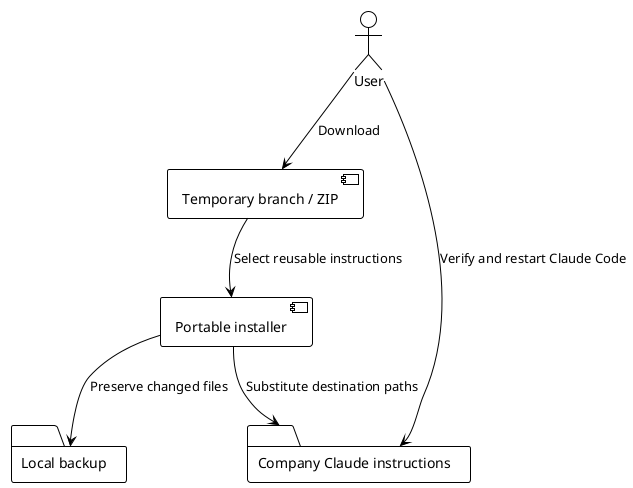

# Company machine transfer

This branch contains reusable instructions, not a copy of the author's Claude home.
No release or version tag is required. Download the branch before deleting it on GitHub.

## Install

Clone `transfer/company-config-20261005` or download its ZIP and extract it.
Run from the extracted repository:

```bash
python3 scripts/install-config.py \
  --codebase-root "$HOME/Documents/Repositories" \
  --vault-root "$HOME/Documents/CompanyDocs" \
  --user-name "Your Name"
python3 scripts/install-config.py --verify
```

Python 3 is the only dependency of the portable installer. The destination is
`~/.claude`; `--target-home /path/to/test-home` supports an isolated trial.
Both setup wrappers accept `--config-only` and use the same installer.
Existing `.team-config.json` paths are reused unless explicit arguments override them.

## Scope

- 16 current rules, 8 active workflows, 4 engineering agents.
- Client discovery, output budget, evidence before changes, secrets and coordination rules.
- Local learning and known-gotcha files are preserved; a new installation starts with empty local notes.
- Old package rules are archived so they do not conflict with the current operational rules.
- Private settings, MCP credentials, personal memory and client contexts are not exported.
- Portable mode does not install hooks, services, dependencies or MCP servers.

Handoff requires a coordination runtime already supplied by the project. Browser
validation requires its configured Chrome DevTools MCP. Do not copy the personal
machine's browser wrappers or assume its API endpoints exist on the company machine.
The historical full setup is specific to the original team and remains optional.

## Client context

Derive organization, stack, commands, integration branch and services from the repository.
Record only non-derivable knowledge-base, tracker, artifact destination, access command
and merge-gate facts in the project's CLAUDE.md. A shared context is needed only when
those facts are repeated across multiple repositories. No employer was assumed here.

## Verification and recovery

`--verify` checks the installed files against the source using the saved destination paths.
Restart Claude Code to load the rules and skills. Use `/commit`, `/investigation` or
another workflow to confirm discovery in that consumer. The company machine was not
accessible during preparation, so this final discovery check remains for that machine.

Changed files and retired rules are saved under `~/.claude/backups/portable-<timestamp>`.
Restore a specific backed-up file to the corresponding `.claude` path when needed.
Do not restore superseded rules alongside their replacements, which causes conflicting instructions.
The original runtime settings and MCP files require no rollback because portable mode leaves them untouched.


