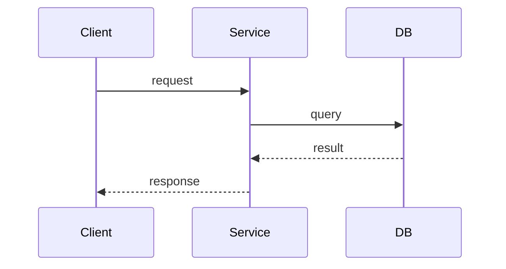
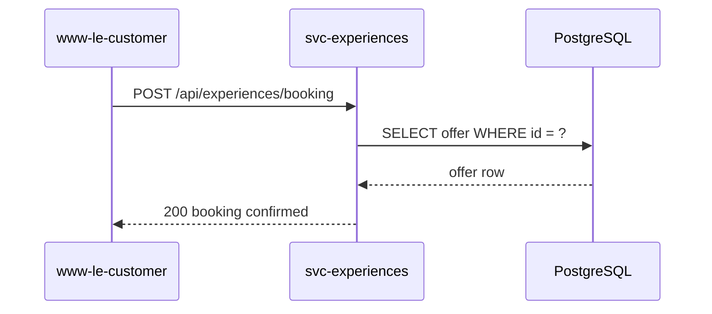

# PR Body Template & Diagram Pipeline

> Parent skill: [create-pr/SKILL.md](../SKILL.md)

## PR Body Structure

Build the PR body by analyzing the actual code changes. Every section must reflect real code, never use placeholders or generic descriptions.

```markdown
# [TICKET-CODE] Feature Name

[One-line summary of what this PR does, what it adds/changes and the mechanism.]

### Changes at a glance

- **[Component/Area 1]**
  - [Specific change with technical detail]
  - [Config, flags, or infra details if applicable]
- **[Component/Area 2]**
  - [What changed and why]
- **[Tests]**
  - [Number of new tests, what they cover]
  - [Any existing test updates]

---

## Why is this change happening?

**Problem: [One sentence stating the core problem.]**

[2-3 paragraphs explaining:

- What exists today and why it's insufficient
- What investigation was done (what was found in the codebase)
- What scenarios/edge cases were identified]

[If applicable, include a scenario table:]

| Scenario | Expected Action |
| -------- | --------------- |
| [case 1] | [what happens]  |
| [case 2] | [what happens]  |

### Approach

[Brief description of the solution strategy, layers, phases, or components involved.]

---

## What changed?

[For each logical group of changes, create a numbered section:]

### 1. [Area, e.g. Config + Schema]

[Explain what was added/modified. Include tables for env vars, config layers, etc.]

### 2. [Area, e.g. Database Queries]

[Explain new queries with SQL snippets. Describe the logic and guards.]

### 3. [Area, e.g. Business Logic / Service]

[Explain the process flow. Include code snippets for key logic.]

### 4. [Area, e.g. API / Controller changes]

[Explain any API surface changes, new endpoints, or modified responses.]

### 5. [Area, e.g. Infra / Pulumi]

[Table of env vars with values per environment (DEV, Staging, PROD).]

---

## Architecture, Sequence Diagrams

[MANDATORY: Include at least 1 Mermaid sequence diagram (2 if the feature has distinct flows).
Use ```mermaid code blocks, GitHub renders them natively.

Show:

- The main happy path flow
- How components interact (who calls whom)
- Decision logic when relevant

Keep diagrams focused, one per distinct flow.]



---

## What have you done to test it?

| Category              | Result                  | Details              |
| --------------------- | ----------------------- | -------------------- |
| **Unit tests**        | [X/X suites, Y/Y tests] | [What's new]         |
| **Integration tests** | [status]                | [What was validated] |
| **Migration**         | [N/A or status]         | [Details]            |

[If significant test coverage, add a detailed table:]

| Test Case            | What it validates |
| -------------------- | ----------------- |
| [test name/scenario] | [what it proves]  |

---

## Summary (product perspective)

[1 paragraph in plain language: what this means for the user/business. No technical jargon. Written so a PM or stakeholder can understand the impact.]

---

## Related

| Link                     | Description           |
| ------------------------ | --------------------- |
| [PR link](url)           | This PR               |
| Jira: [TICKET](url)      | Ticket description    |
| [Related PR/ticket](url) | Dependency or context |
```

## How to generate the content

1. **Read every changed file**, not just the diff, the full file for context
2. **Group changes logically** by area (config, queries, logic, tests, infra), not by file
3. **Include real code snippets**, actual SQL, TypeScript, config from the diff
4. **Generate sequence diagrams**, MANDATORY for any PR with business logic changes (see Diagram Pipeline below)
5. **Count real test numbers**, run `yarn test` if needed to get actual pass/fail counts
6. **Write the product summary last**, after understanding all technical changes

## Diagram Guidelines (mandatory)

Every PR with business logic MUST include at least 1 Mermaid sequence diagram. 2 if the feature has distinct flows (e.g., happy path + error/alternative path).

### How to write Mermaid diagrams

Use fenced code blocks with `mermaid` language identifier. GitHub renders these natively, no external service or encoding needed.

```markdown

```

### Tips for clean Mermaid diagrams

- Use `participant X as Label` for readable names (e.g., `participant FE as www-le-customer`)
- Use `Note over X,Y: text` for annotations and decision points
- Use `alt`/`else`/`end` blocks for conditional flows
- Use `opt`/`end` for optional steps
- Use `<br/>` for line breaks in participant labels (e.g., `participant DB as PostgreSQL<br/>(offer_scores)`)
- Keep participants to 4-6 max per diagram, split into multiple diagrams if more

### Embed in PR body

Just include the fenced code block directly in the PR body markdown. No URLs, no images, no encoding.

### What to diagram

| Scenario                     | Diagrams needed                                 |
| ---------------------------- | ----------------------------------------------- |
| Single endpoint, simple CRUD | 1 sequence (happy path)                         |
| Multi-service feature        | 1 sequence per service interaction              |
| Bug fix with flow change     | 1 "before" + 1 "after" (or combined with notes) |
| Feature with error handling  | 1 happy path + 1 error/fallback path            |
| Config/infra only change     | 0 (skip diagrams section entirely)              |
